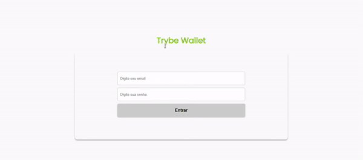
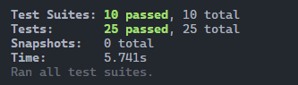

# Trybewallet

Neste projeto desenvolvi uma carteira de controle de gastos com conversor de moedas, ao utilizar essa aplicação o usuário é capaz de:

- Adicionar, remover e editar um gasto;
- Visualizar uma tabelas com seus gastos;
- Visualizar o total de gastos convertidos para uma moeda de escolha;

Projeto feito enquanto estudava na [Trybe](https://www.betrybe.com/), utilizando React, Class Components, Javascript, CSS e Redux no módulo de front-end. Coberto com 100% dos testes da Trybe.


## Instalando o Trybewallet 

Clone o repositório:
```
git clone git@github.com:matheusgb/trybewallet.git
```
Entre na pasta do repositório:
```
cd trybewallet
```
Instale as dependências:
```
npm install
```
Inicie a aplicação:
```
npm start
```

## Direitos autorais

Esse projeto foi desenvolvido por mim ([Matheus Gomes](https://www.linkedin.com/in/matheusgb/)) apenas visando o aprendizado.

